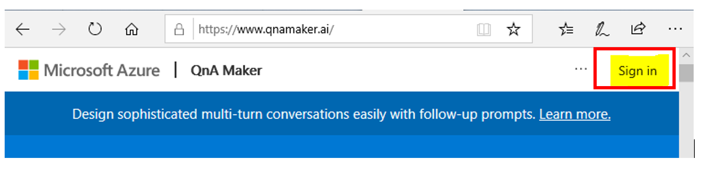

# **Build an FAQ chatbot with QnA Maker and Azure Bot Service**

You will

- Learn what QnA Maker is.
- Learn about key features of QnA Maker and how to create a knowledge base.
- Publish a QnA Maker knowledge base.
- Integrate a knowledge base with a bot.

**Exercise - Create a QnA knowledge base**

Let's create a QnA Maker knowledge base (KB).

1. Go to the [QnA Maker portal](https://www.qnamaker.ai/?).  ([ai](https://qnamaker.ai/))
2. Select **Sign in** in the upper-right corner and sign in with your Azure credentials.

**Exercise - Create a QnA knowledge base**

Let's create a QnA Maker knowledge base (KB).

1. Go to the [QnA Maker portal](https://www.qnamaker.ai/?).  ([ai](https://qnamaker.ai/))
2. Select **Sign in** in the upper-right corner and sign in with your Azure credentials.  Testworkshop 
3. 